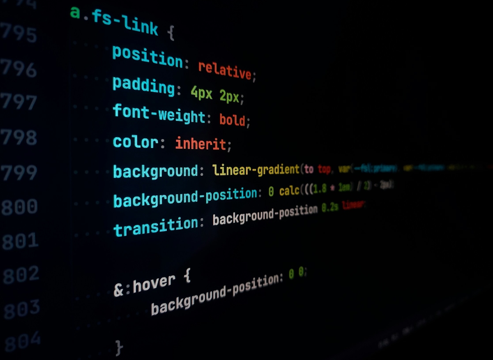

  

# 🖥️ FP INTENSIVA // 2026–2027

### Informática y Comunicaciones

**🌐 Aplicaciones Web (Intro) · 💻 Aplicaciones Web · 🤖 Digitalización Aplicada**

code → test → break → fix → commit → repeat

## 👋 Bienvenidos

Esta es la organización de GitHub que utilizaremos durante el curso **2026–2027** como panel central de información, recursos y anuncios para el grupo de **FP Intensiva**.

Al estar en una modalidad intensiva, optimizar el tiempo es clave. GitHub no será solo una plataforma para entregar tareas; será vuestro entorno diario de trabajo para aprender a desarrollar y gestionar proyectos de la misma forma en que lo hace un equipo técnico en la actualidad.

## 📚 Módulos

### 🌐 Aplicaciones Web (Intro)
**AW-INTRO**  
HTML5 · CSS3 · Diseño Responsivo  
Sentamos las bases del desarrollo frontend. Aprenderemos a estructurar, dar estilo y maquetar sitios web modernos y adaptables.

### 💻 Aplicaciones Web
**AW**  
JavaScript · DOM · Clientes REST · Despliegue  
Damos vida a la web. Añadiremos lógica interactiva con JavaScript, consumiremos datos de APIs externas y aprenderemos a desplegar aplicaciones funcionales.

### 🤖 Digitalización aplicada a los sectores productivos
**DIG**  
IoT · Cloud · IA & Big Data · Metodologías Ágiles  
Entenderemos cómo la tecnología transforma las industrias. Trabajaremos con habilitadores digitales (nube, sensórica, automatización) y aprenderemos a gestionar proyectos usando metodologías ágiles como Scrum o Kanban.

## 📢 Cómo buscaremos y entregaremos las prácticas

Para cumplir estrictamente con la normativa de **Protección de Datos**, el flujo de trabajo de este curso no centralizará vuestro código dentro de esta organización (evitando que otros compañeros tengan acceso a vuestro trabajo). Trabajaremos de la siguiente manera:

### 1. Enunciados y Dudas (GitHub Discussions)
* Cada vez que se publique una práctica o proyecto, el enunciado completo estará disponible en la pestaña **Discussions** (Discusiones) de esta organización, clasificado por el módulo correspondiente.
* Podéis usar los hilos de cada discusión para plantear dudas generales.

### 2. Desarrollo (En tu perfil personal)
* Crearás un repositorio en **tu cuenta personal de GitHub** para resolver la práctica.
* El repositorio debe configurarse como **Privado** para proteger tu código y cumplir la LOPD.

### 3. Entrega y Permisos de Lectura 🔑
Para que el profesor pueda evaluar y corregir tu código, debes concederle acceso de lectura siguiendo estos pasos en tu repositorio personal:
1. Entra en los **Settings** (Configuración) de tu repositorio personal.
2. Ve a la sección **Collaborators** (Colaboradores) en el menú izquierdo.
3. Pulsa en el botón verde **Add people** (Añadir personas).
4. Busca el usuario del profesor (**[TuUsuarioDeGitHub]**) e invítalo con permisos de **Read** (Lectura).
5. Envía el enlace de tu repositorio privado a través de la vía oficial que indique el profesor para su registro.

---

## 🛠️ Herramientas y tecnologías

### 💻 Entorno de trabajo
Utilizaremos **Visual Studio Code** como editor principal y **GitHub Desktop** (o la terminal de Git) para gestionar vuestros repositorios locales personales y sincronizarlos con vuestra cuenta de GitHub.

### 🌐 Stack Tecnológico
Partiremos de **HTML, CSS y JavaScript**, incorporando herramientas de control de versiones y plataformas en la nube para el despliegue de vuestras aplicaciones y flujos de trabajo de digitalización.

## 🧭 Reglas del Juego

1. 📖 **Lee el enunciado completo antes de tocar una línea de código.** La mayoría de los bloqueos se resuelven leyendo las instrucciones publicadas en *Discussions*.
2. 📝 **Commits descriptivos:** Evita mensajes genéricos. 
   * ❌ *cambios*, *arreglos*, *vuelvo a subirlo*
   * ✅ *Añadido menú de navegación responsive*, *Corregido error de validación en el formulario*
3. 🔑 **Seguridad ante todo:** Jamás subas credenciales, tokens, claves privadas ni datos personales a tus repositorios.
4. 🔍 **Interpreta los errores:** Si el navegador o la consola muestran un fallo, lee el mensaje. Aprender a diagnosticar un error es la habilidad más importante de un informático.

## 🤖 Uso Responsable de la IA

Las herramientas de Inteligencia Artificial (Copilot, ChatGPT, etc.) son excelentes aliadas para aprender, buscar explicaciones alternativas o desatascar un error de sintaxis.

Sin embargo, hay una línea muy clara entre **usar la IA para entender** y **copiar código que no sabes cómo funciona**.

⚠️ **Regla de oro:** Si entregas un fragmento de código, debes ser capaz de explicar perfectamente qué hace y por qué está ahí.

## 🎯 El Objetivo

En la FP Intensiva avanzamos rápido. El objetivo no es acumular prácticas perfectas a la primera, sino interiorizar la dinámica profesional:

**Pensar → Probar → Equivocarse → Investigar → Corregir → Comprender**

---
### FP Intensiva · 2026–2027
**Learn · Build · Break · Fix · Repeat**

